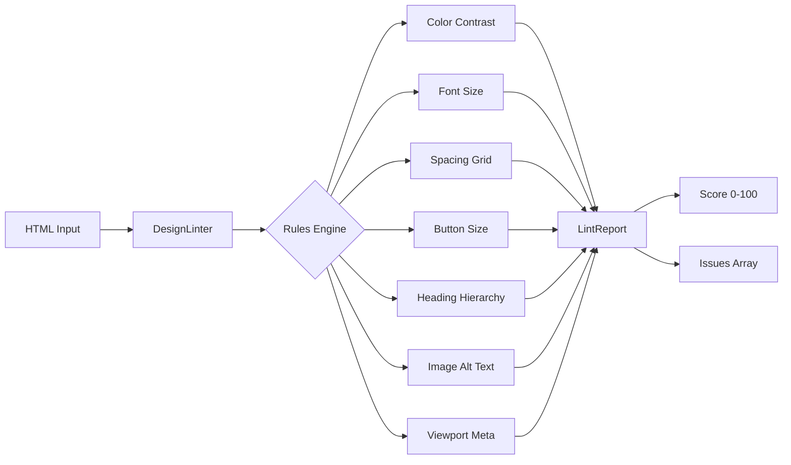

# DesignLint

[](https://github.com/MukundaKatta/DesignLint/actions/workflows/ci.yml)
[](./LICENSE)
[](https://nodejs.org/)
[](https://www.typescriptlang.org/)

**A UI/UX design linter that analyzes HTML/CSS for accessibility, contrast, spacing, and design best practices.**

> Inspired by the AI design review tools trend. Catch design issues before they reach production.

---

## Architecture



## Quick Start

```bash
npm install
npm run build
```

## Usage

```typescript
import { DesignLinter } from "designlint";

const linter = new DesignLinter();

const html = `
<html>
<head><title>My Page</title></head>
<body>
  <h1>Welcome</h1>
  <h3>Oops, skipped h2</h3>
  <p style="color: #eeeeee; background-color: #ffffff; font-size: 10px">
    Hard to read text
  </p>
  
  <button style="width: 30px; height: 30px">X</button>
</body>
</html>
`;

const report = linter.lint(html);

console.log(`Score: ${report.score}/100`);
console.log(report.summary);

for (const issue of report.issues) {
  console.log(`[${issue.severity.toUpperCase()}] ${issue.id}: ${issue.message}`);
  console.log(`  Element: ${issue.element}`);
  console.log(`  Fix: ${issue.suggestion}\n`);
}
```

### Example Output

```
Score: 24/100
Found 6 issue(s): 4 error(s), 2 warning(s). Design score: 24/100.

[ERROR] color-contrast: Color contrast ratio 1.07:1 is below the WCAG AA minimum of 4.5:1.
  Element: <p style="...">
  Fix: Increase contrast between foreground (#eeeeee) and background (#ffffff).

[WARNING] font-size-minimum: Font size 10px (10px) is below the minimum of 12px.
  Element: <p style="...">
  Fix: Increase font size to at least 12px for readability.

[WARNING] heading-hierarchy: Heading <h3> skips level(s) after <h1>.
  Element: <h3>
  Fix: Use <h2> instead of <h3> to maintain a logical heading hierarchy.

[ERROR] image-alt-text: Image is missing meaningful alt text.
  Element: 
  Fix: Add a descriptive alt attribute that conveys the image content or purpose.

[ERROR] button-size: Interactive element width 30px is below the minimum touch target of 44px.
  Element: <button style="...">
  Fix: Set minimum width to 44px for accessible touch targets.

[WARNING] viewport-meta: Document is missing a responsive viewport meta tag.
  Element: <head>
  Fix: Add <meta name="viewport" content="width=device-width, initial-scale=1"> inside <head>.
```

## Rules

| Rule | Description | Default Severity |
|------|-------------|-----------------|
| `color-contrast` | WCAG AA contrast ratio (4.5:1 min) | error |
| `font-size-minimum` | Text below 12px | warning |
| `spacing-consistency` | Spacing not on 4px grid | info |
| `button-size` | Touch targets below 44x44px | error |
| `heading-hierarchy` | Skipped heading levels | warning |
| `image-alt-text` | Missing/empty alt on images | error |
| `viewport-meta` | Missing responsive viewport | warning |

## Custom Configuration

```typescript
const linter = new DesignLinter({
  rules: {
    colorContrast: { enabled: true, severity: "error", minRatio: 7.0 }, // AAA
    fontSizeMinimum: { enabled: true, severity: "error", minPx: 14 },
    spacingConsistency: { enabled: false, severity: "info", baseUnit: 8 },
  },
});
```

## Development

```bash
make install   # Install dependencies
make build     # Compile TypeScript
make test      # Run tests
make lint      # Type-check
```

## Contributing

See [CONTRIBUTING.md](./CONTRIBUTING.md) for guidelines.

## License

[MIT](./LICENSE) - Copyright 2026 Officethree Technologies

---

Built by **Officethree Technologies** | Made with ❤️ and AI
